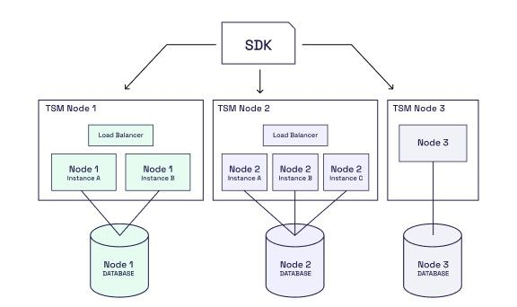

# TSM Multi Instance with tsm-node chart

This directory has an example of deploying a multi instance TSM cluster with the tsm-node helm chart to a single kubernetes cluster.

## Prerequisites
 - An EKS cluster deployed with the [AWS Loadbalancer Controller](https://docs.aws.amazon.com/eks/latest/userguide/aws-load-balancer-controller.html) installed and configured. 

The cluster deployed will look like this:




The values files (tsm<0-2>.yaml) have example configurations for deploying each node in a way that they can communicate with each other and provision ingress to the SDK port.

To deploy, you would perform 3 helm deployments:
```
helm install tsm0 blockdaemon/tsm-node --create-namespace -n tsm -f tsm0.yaml
helm install tsm1 blockdaemon/tsm-node --create-namespace -n tsm -f tsm1.yaml
helm install tsm2 blockdaemon/tsm-node --create-namespace -n tsm -f tsm2.yaml
```

